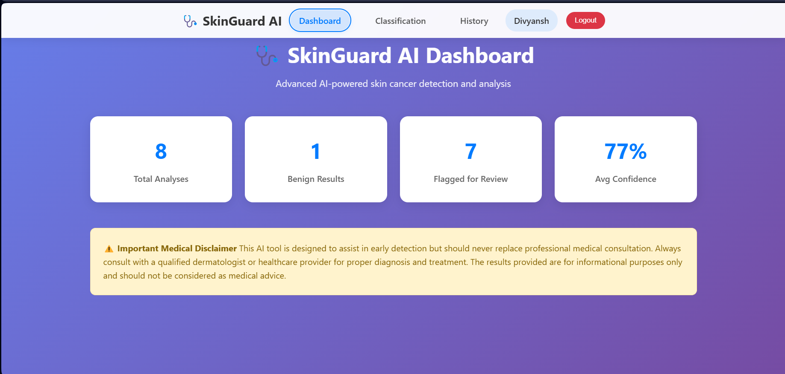
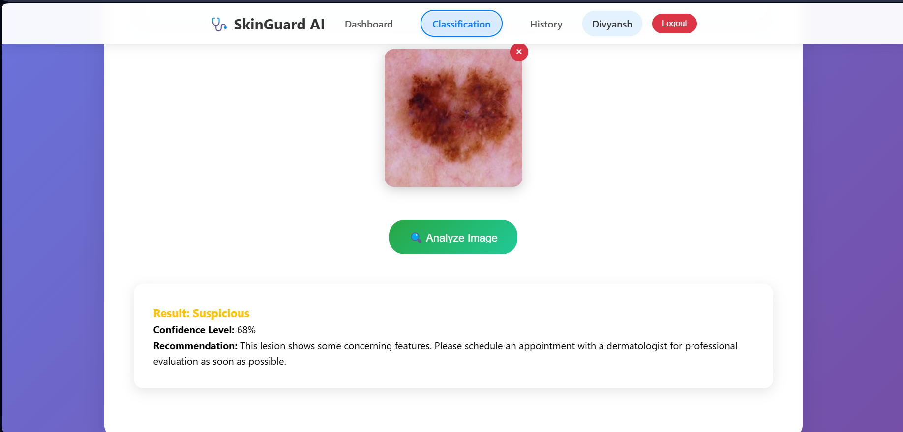
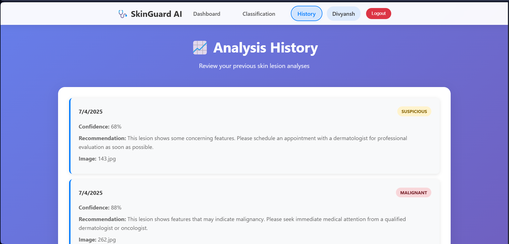
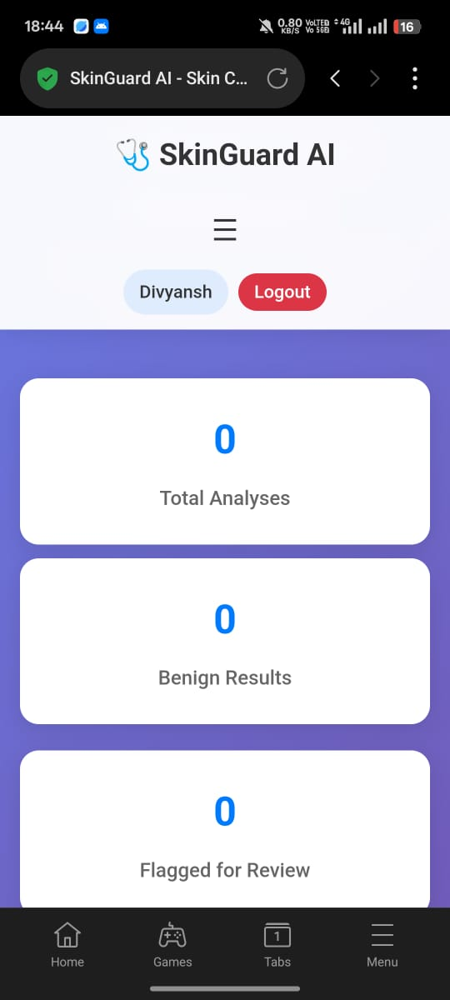
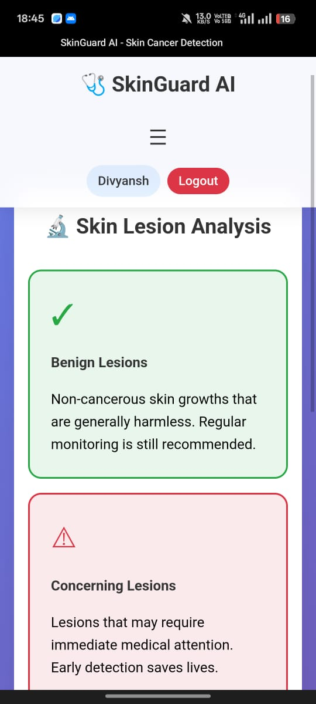

# 🧠 Skin Cancer Detection using Deep Learning

A Deep Learning-powered web application that detects skin cancer from dermatoscopic images. This project uses a Convolutional Neural Network (CNN) to classify images as **benign** or **malignant** and provides a user-friendly interface to upload and predict results in real-time.

---

## 🚀 Features

- ✅ Built using **TensorFlow** and **Keras**
- ✅ Image classification using CNN architecture
- ✅ Trained on the **HAM10000 (ISIC)** dataset
- ✅ Real-time predictions via web interface (Flask / Streamlit)
- ✅ Clean, responsive UI for easy image upload and result viewing

📁 PROJECT STRUCTURE -->
skin-cancer-detection/
│
├── app/                         # Python scripts (core logic)
│   ├── model_training.py        # Model training script
│   ├── model_inference.py       # Prediction / inference script
│   ├── skin_cancer_classification.py  # Main executable or controller
│
├── web/                         # Frontend files (HTML, CSS, JS)
│   ├── about.html
│   ├── contact.html
│   ├── dashboard.html
│   ├── classify.html
│   ├── help.html
│   ├── history.html
│   ├── index1.html
│   ├── profile.html
│   ├── script.js
│   ├── style.css
│
├── screenshots/                 # UI screenshots for README
│   ├── classification.png
│   ├── dashboard.png
│   ├── result.png
│   ├── history.png
│
├── requirements.txt             # Python dependencies
└── README.md                    # Project documentation
                   
---

## 📚 Dataset

- 📦 **Dataset Used:** [HAM10000 - Skin Cancer Dataset (Kaggle)](https://www.kaggle.com/datasets/kmader/skin-cancer-mnist-ham10000)
- 📸 ~10,000 dermatoscopic images of skin lesions
- 🔍 Classes merged into binary: `Benign` and `Malignant`

---

## 📷 Screenshots

### 🏠 Homepage

---

### 📤 Upload Image

---

### 📊 Prediction Result

### 📜 Prediction History
This section stores the past predictions made by the user with corresponding results, images, and timestamps for easy tracking and analysis.

Also supported in mobile -->

---

